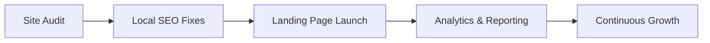
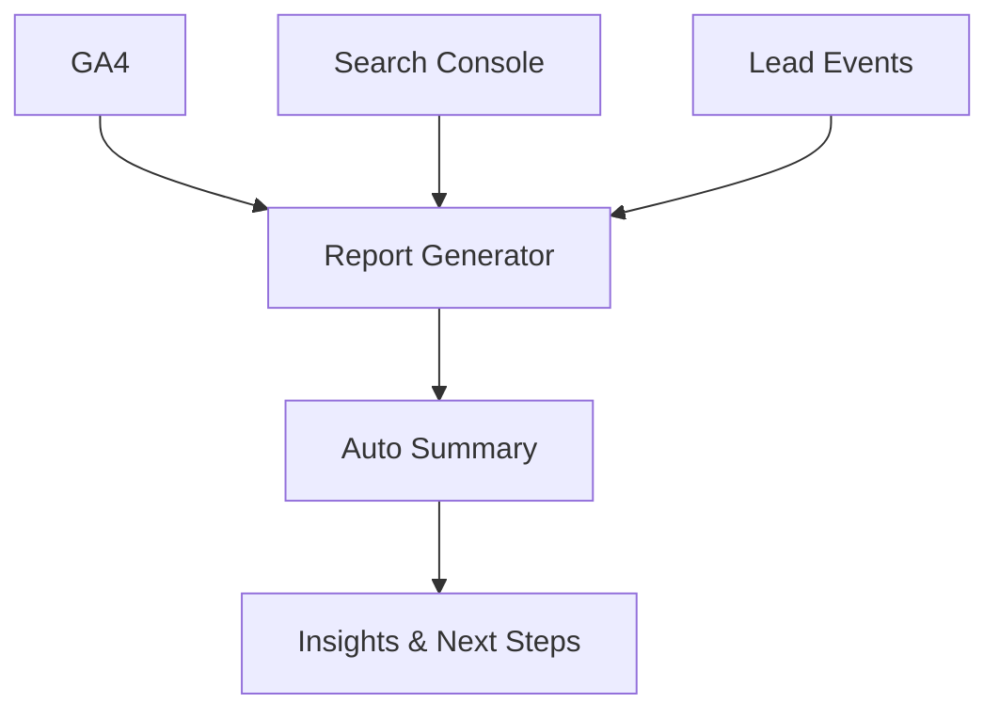

# Clínica Dental Goyanca

## Executive Proposal

**Local SEO Improvement · Fast Landing Page Launch · Automated Reporting**

---

## Executive Summary

Clínica Dental Goyanca has a clear opportunity to improve local visibility, launch a stronger landing page quickly, and eliminate time spent on manual reporting. The best path forward is connecting SEO, conversion, and reporting into one practical growth system — built for speed, measurable from day one.

---

## Approach

The work begins with clarity and moves fast. A focused audit comes first, then high-impact SEO fixes, a new landing page, and clean performance tracking — creating immediate progress while laying a stronger long-term foundation.

---

## Phase 1 — Audit & Discovery

Review current site structure and identify the highest-impact gaps:

| Area | What We Check |
|------|--------------|
| Local SEO signals | NAP consistency, Google Business Profile, citations |
| On-page SEO | Titles, H1s, meta descriptions, internal linking |
| Technical health | Page speed, mobile experience, Core Web Vitals |
| Conversion | CTAs, booking flow, trust signals |
| Analytics | GA4 setup, goal tracking, Search Console coverage |

---

## Phase 2 — Local SEO

Strategy focused on **high-intent local searches** — not more traffic in general, but more qualified traffic from patients in Goya and nearby areas.

### Priority Improvements

- **Service pages** — Clear, keyword-rich content per treatment
- **Location relevance** — City + neighborhood signals throughout the site
- **Structured data** — Local Business schema, reviews schema, FAQ schema
- **Internal linking** — Connect services, location, and trust pages
- **Trust signals** — Reviews, financing options, treatment information
- **FAQ content** — Answer real patient questions, capture long-tail searches

### Target Intent Categories

| Intent | Example Keywords |
|--------|----------------|
| Emergency | dentista urgencias Goya, dolor de muela |
| Cosmetic | blanqueamiento dental, carillas |
| Orthodontics | ortodoncia Goya, brackets adultos |
| Implants | implantes dentales precio Goya |
| General | dentista Goya, clínica dental cerca |

---

## Phase 3 — New Landing Page

**Fast launch. Built around conversion.**

The page must explain the clinic clearly, load quickly, build trust immediately, and make booking easy through every available channel.

### Core Sections

1. **Hero** — Clear value proposition + primary CTA (WhatsApp / phone)
2. **Services** — Top treatments with clear descriptions
3. **Why Us** — Differentiators: experience, technology, financing
4. **Social Proof** — Patient reviews, ratings, before/after
5. **Location & Hours** — Map embed, address, schedule
6. **Financing** — Payment options, accessibility messaging
7. **Contact** — WhatsApp, phone, and form — all in one section

### Technical Standards

- Mobile-first, fully responsive
- Lighthouse score 90+ (Performance, SEO, Accessibility)
- Core Web Vitals: LCP < 2.5s, CLS < 0.1
- WhatsApp deep link with pre-filled message
- Structured data embedded

---

### Reference Implementation — Dental Studio Landing

This is already done. Onmidental's own landing page is live — built with the same stack, structure, and SEO foundations proposed here for Goyanca.

| | |
|--|--|
| **Live demo** | https://onmidental.vercel.app |
| **Source code** | https://github.com/DavidVique1998/onmidental |

#### What was built

| Feature | Detail |
|---------|--------|
| Animated hero | Scroll-driven 3D tooth model (Three.js / React Three Fiber) |
| AI chat assistant | Answers patient questions in real time — no cold starts |
| Full section coverage | Services · About · Clinics · Team · Financing · Reviews · Instagram |
| WhatsApp button | Floating CTA with pre-filled message |
| SEO foundation | sitemap.xml, robots.txt, Open Graph, JSON-LD (LocalBusiness + Dentist schema) |
| Performance | Next.js 16 App Router, Tailwind CSS v4, edge-runtime AI route |
| Deployment | Live on Vercel in production |

The same structure, component library, and SEO patterns apply directly to the Goyanca landing. Starting from a proven base means faster delivery and lower risk.

---

## Phase 4 — Reporting Automation

Manual reports replaced by an automated workflow.

### Data Sources

- **Google Analytics 4** — Sessions, conversions, channel performance
- **Google Search Console** — Rankings, impressions, click-through rates
- **Lead events** — WhatsApp clicks, phone clicks, form submissions

### Automated Report Output

Each report delivers:

1. Key metrics vs. prior period
2. Top-performing pages and search queries
3. Conversion funnel snapshot
4. Recommended next actions

---

## Use of AI

AI accelerates execution and reduces repetitive work — human review keeps quality high.

| Task | AI Role |
|------|---------|
| Keyword clustering | Group and prioritize by intent and volume |
| Page copy | First-pass drafts for service pages and FAQs |
| FAQ generation | Extract real patient questions from search data |
| Landing page iteration | Fast variant testing and copy refinement |
| Report summaries | Auto-generate insights from raw analytics data |

---

## Why This Fit Is Strong

Onmidental already has the landing, the stack, and the SEO structure in place. Extending that to Goyanca means faster delivery, lower risk, and consistency across the network — not starting from zero.

---

## Recommended 7-Day Sprint

| Day | Deliverable |
|-----|------------|
| 1–2 | Full site audit — SEO, technical, analytics, conversion |
| 3 | Top local SEO fixes implemented |
| 4–5 | New landing page launched |
| 6 | Analytics connected — GA4, Search Console, lead events |
| 7 | First automated report generated and reviewed |

---

*Results measurable from day one. Growth compound over time.*
